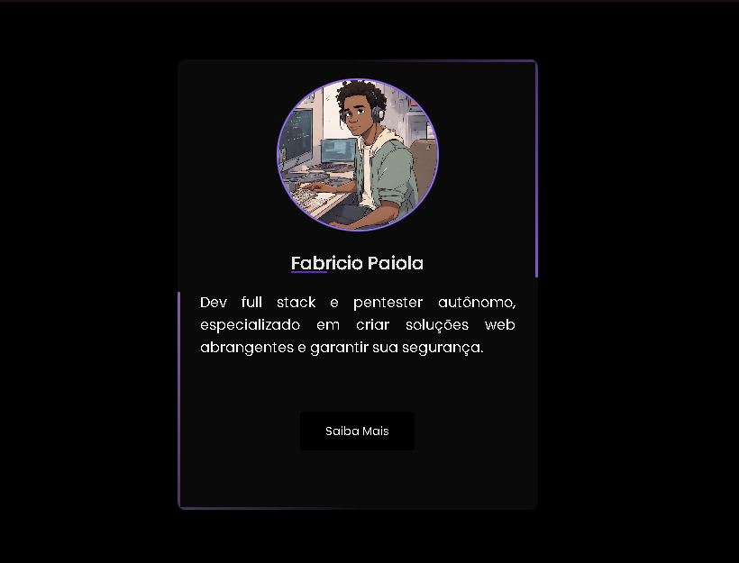

# Card de Habilidades em Desenvolvimento Web

# Meu Projeto

Este é um cartão que destaca minhas habilidades em desenvolvimento web, com foco em HTML, CSS e JavaScript.

## Habilidades Destacadas

- **HTML:** Desenvolvimento de páginas web semânticas e acessíveis, estruturando o conteúdo de forma eficaz.

- **CSS:** Estilização de páginas web com CSS3, incluindo layouts responsivos, Flexbox e animações.

- **JavaScript:** Programação client-side para interatividade, manipulação do DOM e uso de bibliotecas/frameworks.

## Como Usar

Este cartão é uma representação visual das minhas habilidades em desenvolvimento web. Você pode usá-lo em seu próprio projeto para destacar suas competências.
